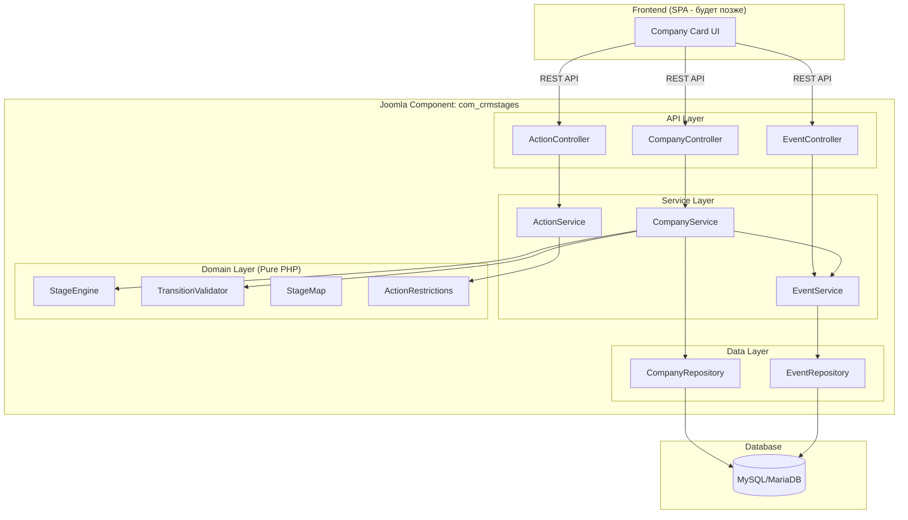

# Design Document: CRM Stages

## Overview

Система реализуется как Joomla 4 компонент (`com_crmstages`) с REST API бэкендом и отдельным фронтендом (SPA, будет позже). Бэкенд следует MVC-архитектуре Joomla с чётким разделением на доменный слой (чистая бизнес-логика без зависимости от Joomla), сервисный слой и слой контроллеров/API.

Ключевое архитектурное решение: вся логика стадий и валидации вынесена в чистые PHP-классы (Domain layer), которые не зависят от Joomla Framework. Это позволяет:
- Тестировать бизнес-логику изолированно через PHPUnit
- Переносить логику на другой фреймворк при необходимости
- Использовать property-based тестирование без моков Joomla

### Обоснование выбора компонента

Компонент (а не модуль/плагин) выбран потому что:
- Компонент — основная единица функциональности в Joomla, поддерживает собственные таблицы, MVC, маршрутизацию
- Модуль слишком ограничен для полноценной CRM-логики
- Плагин не предназначен для самостоятельных страниц и CRUD-операций

## Architecture



### Слои архитектуры

1. **API Layer** — контроллеры Joomla, принимают HTTP-запросы, валидируют входные данные, возвращают JSON
2. **Service Layer** — оркестрация: координирует вызовы доменных объектов и репозиториев
3. **Domain Layer** — чистая бизнес-логика: StageEngine, TransitionValidator, StageMap, ActionRestrictions. Без зависимостей от Joomla
4. **Data Layer** — репозитории для работы с БД через Joomla Database API

## Components and Interfaces

### Domain Layer

#### StageMap
Определяет конфигурацию всех стадий и их порядок.

```php
class StageMap
{
    // Возвращает все стадии в порядке воронки
    public function getOrderedStages(): array;

    // Возвращает следующую стадию или null для терминальных
    public function getNextStage(string $stageCode): ?string;

    // Проверяет, является ли стадия терминальной
    public function isTerminal(string $stageCode): bool;

    // Возвращает индекс стадии в воронке
    public function getStageIndex(string $stageCode): int;

    // Возвращает метаданные стадии (название, код MLS, инструкции)
    public function getStageInfo(string $stageCode): StageInfo;
}
```

#### StageEngine
Управляет переходами между стадиями.

```php
class StageEngine
{
    public function __construct(TransitionValidator $validator, StageMap $stageMap);

    // Попытка перехода на следующую стадию
    public function transition(Company $company, array $events): TransitionResult;

    // Попытка перехода в Null (отказ)
    public function transitionToNull(Company $company): TransitionResult;

    // Получить доступные действия для текущей стадии
    public function getAvailableActions(string $stageCode): array;
}
```

#### TransitionValidator
Проверяет условия выхода из каждой стадии.

```php
class TransitionValidator
{
    // Проверяет, выполнены ли условия выхода из текущей стадии
    public function validate(string $currentStage, array $events): ValidationResult;
}
```

`ValidationResult` содержит `isValid: bool` и `errors: string[]`.

#### ActionRestrictions
Определяет, какие действия запрещены на каждой стадии.

```php
class ActionRestrictions
{
    // Возвращает список разрешённых действий для стадии
    public function getAllowedActions(string $stageCode): array;

    // Возвращает список запрещённых действий для стадии
    public function getRestrictedActions(string $stageCode): array;

    // Проверяет, разрешено ли действие на данной стадии
    public function isActionAllowed(string $stageCode, string $action): bool;
}
```

### Service Layer

#### CompanyService

```php
class CompanyService
{
    public function getCompany(int $id): CompanyDTO;
    public function transitionStage(int $companyId, int $managerId): TransitionResult;
    public function transitionToNull(int $companyId, int $managerId): TransitionResult;
    public function getCompanyCard(int $companyId): CompanyCardDTO;
}
```

#### EventService

```php
class EventService
{
    public function recordEvent(int $companyId, int $managerId, string $type, array $payload): Event;
    public function getEvents(int $companyId, ?string $typeFilter = null): array;
}
```

#### ActionService

```php
class ActionService
{
    public function executeAction(int $companyId, int $managerId, string $action, array $data): ActionResult;
}
```

### Data Transfer Objects

```php
class CompanyDTO
{
    public int $id;
    public string $name;
    public string $stageCode;
    public string $stageName;
    public string $createdAt;
    public string $updatedAt;
}

class CompanyCardDTO
{
    public CompanyDTO $company;
    public StageInfo $stageInfo;
    public array $availableActions;
    public string $instruction;
    public array $events;
}

class StageInfo
{
    public string $code;
    public string $mlsCode;
    public string $name;
    public string $instruction;
    public array $exitConditions;
    public array $restrictions;
}

class TransitionResult
{
    public bool $success;
    public ?string $newStage;
    public array $errors;
}

class Event
{
    public int $id;
    public int $companyId;
    public int $managerId;
    public string $type;
    public array $payload;
    public string $createdAt;
}
```

### API Endpoints

| Method | Endpoint | Description |
|--------|----------|-------------|
| GET | `/api/companies/{id}` | Получить карточку компании |
| POST | `/api/companies/{id}/transition` | Перейти на следующую стадию |
| POST | `/api/companies/{id}/transition-null` | Перейти в Null |
| POST | `/api/companies/{id}/actions/{action}` | Выполнить действие |
| GET | `/api/companies/{id}/events` | Получить журнал событий |
| GET | `/api/companies/{id}/events?type={type}` | Фильтр событий по типу |

## Data Models

### Таблица `#__crmstages_companies`

| Column | Type | Description |
|--------|------|-------------|
| id | INT AUTO_INCREMENT PK | ID компании |
| name | VARCHAR(255) NOT NULL | Название компании |
| stage_code | VARCHAR(32) NOT NULL DEFAULT 'Ice' | Текущая стадия |
| created_at | DATETIME NOT NULL | Дата создания |
| updated_at | DATETIME NOT NULL | Дата обновления |
| created_by | INT NOT NULL | ID менеджера-создателя |

Индексы:
- `idx_stage_code` на `stage_code` — для фильтрации по стадиям
- `idx_created_by` на `created_by` — для фильтрации по менеджеру

### Таблица `#__crmstages_events`

| Column | Type | Description |
|--------|------|-------------|
| id | INT AUTO_INCREMENT PK | ID события |
| company_id | INT NOT NULL FK | ID компании |
| manager_id | INT NOT NULL | ID менеджера |
| event_type | VARCHAR(64) NOT NULL | Тип события |
| payload | JSON | Данные события |
| created_at | DATETIME NOT NULL | Дата события |

Индексы:
- `idx_company_id` на `company_id` — для выборки событий компании
- `idx_company_type` на `(company_id, event_type)` — для фильтрации по типу
- `idx_created_at` на `created_at` — для сортировки по времени
- `idx_company_created` на `(company_id, created_at DESC)` — для пагинации журнала

### Таблица `#__crmstages_discovery`

| Column | Type | Description |
|--------|------|-------------|
| id | INT AUTO_INCREMENT PK | ID записи |
| company_id | INT NOT NULL FK UNIQUE | ID компании |
| needs | TEXT | Потребности клиента |
| budget | VARCHAR(128) | Бюджет |
| timeline | VARCHAR(128) | Сроки |
| decision_makers | TEXT | ЛПР |
| filled_at | DATETIME | Дата заполнения |
| filled_by | INT | ID менеджера |

### Таблица `#__crmstages_demos`

| Column | Type | Description |
|--------|------|-------------|
| id | INT AUTO_INCREMENT PK | ID записи |
| company_id | INT NOT NULL FK | ID компании |
| scheduled_at | DATETIME NOT NULL | Дата/время демо |
| conducted_at | DATETIME | Дата проведения |
| demo_link | VARCHAR(512) | Ссылка на демо |
| created_by | INT NOT NULL | ID менеджера |

Индекс: `idx_company_id` на `company_id`

### Таблица `#__crmstages_invoices`

| Column | Type | Description |
|--------|------|-------------|
| id | INT AUTO_INCREMENT PK | ID счёта |
| company_id | INT NOT NULL FK | ID компании |
| amount | DECIMAL(12,2) | Сумма |
| status | VARCHAR(32) DEFAULT 'created' | Статус: created, sent, paid |
| created_at | DATETIME NOT NULL | Дата создания |
| paid_at | DATETIME | Дата оплаты |
| created_by | INT NOT NULL | ID менеджера |

Индекс: `idx_company_status` на `(company_id, status)`

### Таблица `#__crmstages_certificates`

| Column | Type | Description |
|--------|------|-------------|
| id | INT AUTO_INCREMENT PK | ID удостоверения |
| company_id | INT NOT NULL FK | ID компании |
| certificate_number | VARCHAR(128) NOT NULL | Номер удостоверения |
| issued_at | DATETIME NOT NULL | Дата выдачи |
| issued_by | INT NOT NULL | ID менеджера |

Индекс: `idx_company_id` на `company_id`

### Масштабирование до ~10k компаний/день

Принципы:
1. **Индексация**: Составные индексы на часто используемые комбинации (company_id + event_type, company_id + created_at). Покрывающие индексы для основных запросов
2. **Журнал событий (Event Sourcing lite)**: Таблица событий — append-only, минимум блокировок при записи. Текущее состояние хранится в companies (materialized view), события — полный лог
3. **Минимизация блокировок**: UPDATE companies SET stage_code = ? WHERE id = ? AND stage_code = ? (optimistic locking). Событие записывается в отдельной транзакции
4. **Партиционирование**: При росте — партиционирование events по created_at (месячные партиции)
5. **Кэширование**: Redis/Memcached для карточек компаний, инвалидация при записи события
6. **Логирование**: Структурированные логи в JSON, отдельный поток для аналитики


## Correctness Properties

*A property is a characteristic or behavior that should hold true across all valid executions of a system — essentially, a formal statement about what the system should do. Properties serve as the bridge between human-readable specifications and machine-verifiable correctness guarantees.*

Свойства ниже выведены из acceptance criteria через prework-анализ. Каждое свойство универсально квантифицировано и предназначено для property-based тестирования.

### Property 1: Transition validity — transition succeeds if and only if exit conditions are met

*For any* company at any stage and any set of events, calling `StageEngine::transition()` should succeed if and only if `TransitionValidator::validate()` returns `isValid = true` for that stage and event set. If conditions are not met, the transition must fail with descriptive errors.

**Validates: Requirements 1.2, 1.3**

### Property 2: Sequential transitions only — no stage skipping

*For any* company at stage S, the only valid forward transition target is the immediately next stage in the StageMap ordering. Attempting to reach any other stage (except Null) must be rejected.

**Validates: Requirements 1.5, 1.6**

### Property 3: Action restrictions are enforced per stage

*For any* stage and any action, `ActionRestrictions::isActionAllowed(stage, action)` must return `false` for all restricted actions defined for that stage, and `true` for all allowed actions. Attempting a restricted action through `ActionService` must result in rejection with an error listing allowed actions.

**Validates: Requirements 3.2, 4.2, 5.2, 14.1, 14.2, 14.3, 14.4, 14.5**

### Property 4: Demo freshness constraint — 60-day window

*For any* company in the Demo_done stage, if the most recent `demo_conducted` event is older than 60 days, the TransitionValidator must reject the transition to Committed. If the demo is within 60 days, and an invoice or KP exists, the transition must be allowed.

**Validates: Requirements 7.2, 7.3**

### Property 5: Null stage is reachable from any active stage and is terminal

*For any* company at any non-Null stage, `StageEngine::transitionToNull()` must succeed. *For any* company at the Null stage, all transitions (including transitionToNull) must be rejected.

**Validates: Requirements 13.1, 13.4**

### Property 6: Event completeness — all events contain required fields

*For any* event recorded through `EventService::recordEvent()`, the resulting Event object must contain non-null values for: id, company_id, manager_id, event_type, payload, and created_at.

**Validates: Requirements 10.2**

### Property 7: Event ordering — reverse chronological

*For any* company with multiple events, `EventService::getEvents(companyId)` must return events sorted by `created_at` in descending order (newest first).

**Validates: Requirements 10.3**

### Property 8: Event filtering — type match

*For any* company and any event type filter, all events returned by `EventService::getEvents(companyId, typeFilter)` must have `event_type` equal to the filter value.

**Validates: Requirements 10.4**

### Property 9: Company state serialization round-trip

*For any* valid CompanyDTO, serializing it to JSON and then deserializing back must produce an equivalent CompanyDTO with identical field values.

**Validates: Requirements 12.3**

### Property 10: Event serialization round-trip

*For any* valid Event object, serializing it to JSON and then deserializing back must produce an equivalent Event with identical field values.

**Validates: Requirements 12.5**

## Error Handling

### Стратегия обработки ошибок

1. **Validation Errors (400)**: Невыполненные условия перехода, запрещённые действия, невалидные входные данные. Возвращают JSON с массивом ошибок.
2. **Not Found (404)**: Компания не найдена.
3. **Conflict (409)**: Optimistic locking — стадия изменилась между чтением и записью. Клиент должен перечитать данные.
4. **Internal Server Error (500)**: Непредвиденные ошибки. Логируются, клиенту возвращается generic-сообщение.

### Формат ошибки API

```json
{
    "success": false,
    "errors": [
        {
            "code": "TRANSITION_CONDITIONS_NOT_MET",
            "message": "Cannot transition from Ice to Touched: no LPR conversation recorded",
            "details": {
                "current_stage": "Ice",
                "target_stage": "Touched",
                "unmet_conditions": ["lpr_conversation_required"]
            }
        }
    ]
}
```

### Коды ошибок

| Code | HTTP | Description |
|------|------|-------------|
| TRANSITION_CONDITIONS_NOT_MET | 400 | Условия перехода не выполнены |
| STAGE_SKIP_NOT_ALLOWED | 400 | Попытка перепрыгнуть стадию |
| ACTION_RESTRICTED | 400 | Действие запрещено на текущей стадии |
| DEMO_EXPIRED | 400 | Демо проведено более 60 дней назад |
| NULL_STAGE_TERMINAL | 400 | Компания в терминальной стадии Null |
| COMPANY_NOT_FOUND | 404 | Компания не найдена |
| STAGE_CONFLICT | 409 | Конфликт стадий (optimistic locking) |

## Testing Strategy

### Фреймворки

- **Unit/Integration тесты**: PHPUnit 10+
- **Property-based тесты**: [Eris](https://github.com/giorgiosironi/eris) — порт QuickCheck для PHP/PHPUnit
- **Минимум 100 итераций** на каждый property-тест

### Двойной подход к тестированию

**Unit-тесты** (конкретные примеры и edge cases):
- Каждый переход стадии: позитивный и негативный сценарий
- Ограничения действий для каждой стадии
- Правило 60 дней для Demo_done
- Null-стадия: вход из каждой стадии, терминальность
- Сериализация/десериализация конкретных объектов

**Property-based тесты** (универсальные свойства):
- Property 1: Transition validity
- Property 2: Sequential transitions
- Property 3: Action restrictions
- Property 4: Demo freshness
- Property 5: Null stage behavior
- Property 6: Event completeness
- Property 7: Event ordering
- Property 8: Event filtering
- Property 9: Company state round-trip
- Property 10: Event round-trip

### Генераторы для PBT

Для property-based тестов потребуются генераторы:
- `arbitraryStageCode()` — случайная стадия из StageMap
- `arbitraryCompany()` — компания со случайной стадией
- `arbitraryEventList(stageCode)` — набор событий, соответствующих (или не соответствующих) условиям стадии
- `arbitraryAction()` — случайное действие
- `arbitraryCompanyDTO()` — случайный CompanyDTO для round-trip тестов
- `arbitraryEvent()` — случайный Event для round-trip тестов

### Аннотация тестов

Каждый property-тест аннотируется комментарием:
```php
// Feature: crm-stages, Property 1: Transition validity — transition succeeds iff exit conditions met
// Validates: Requirements 1.2, 1.3
```
